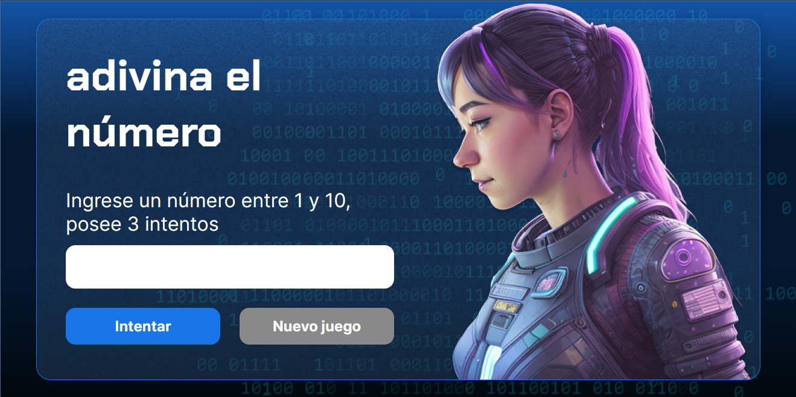

# Juego de adivinar un número

## Descripción
Este es un juego de adivinar un número entre 1 y 10. El juego te va dando pistas de si el número que has introducido es mayor o menor que el número a adivinar.

## Imagen del juego

## Como jugar
Para jugar a este juego, debes ir a la pagina de [Juego de adivinar un número](https://srdevel.github.io/juego-numero-secreto/). Una vez allí, debes introducir un número entre 1 y 10 y pulsar el botón de "Comprobar". El juego te irá dando pistas de si el número que has introducido es mayor o menor que el número a adivinar. Si aciertas el número, el juego te felicitará y te dirá el número de intentos que has necesitado para adivinarlo.

## Tecnologías utilizadas
Para la realización de este juego, se han utilizado las siguientes tecnologías:
* HTML
* CSS
* JavaScript